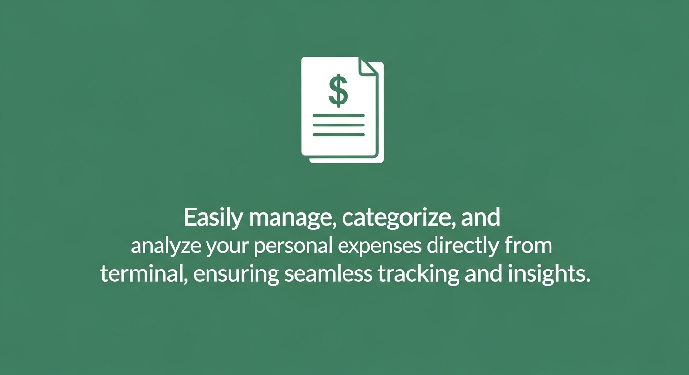
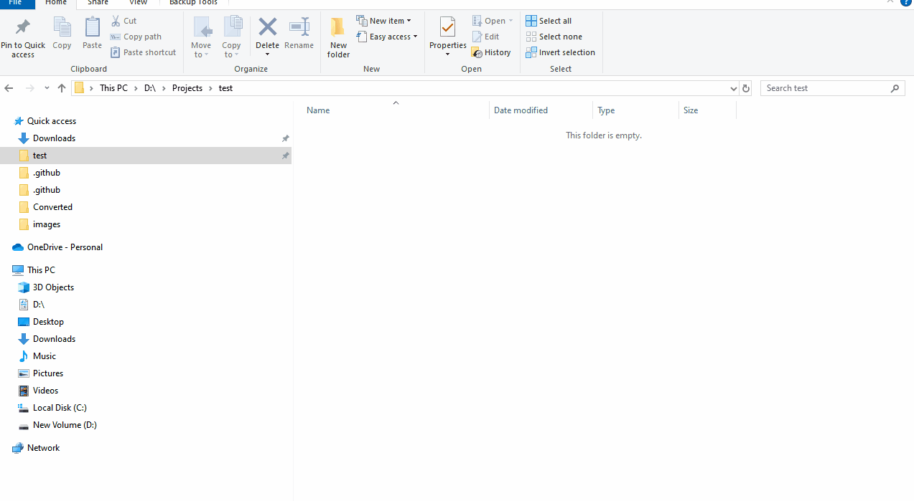
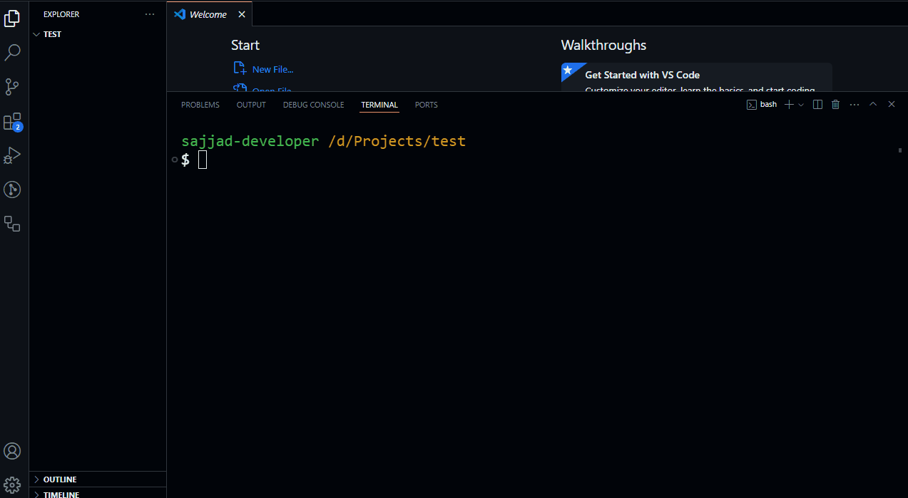
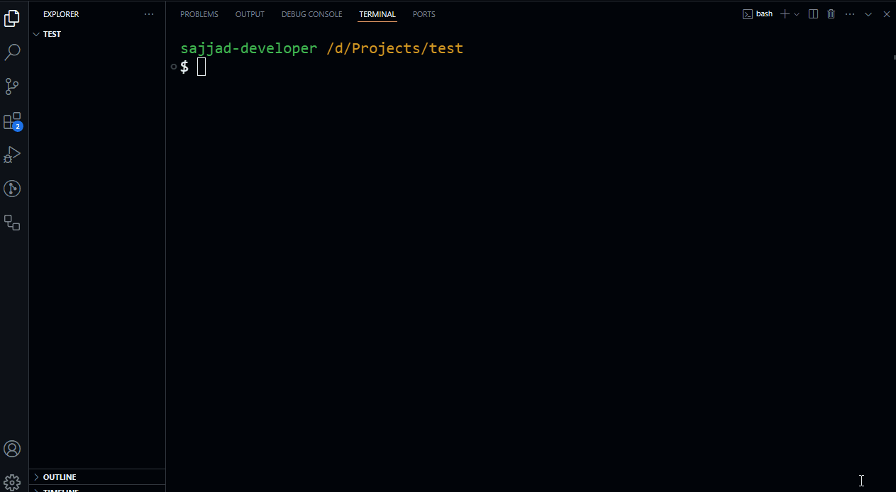
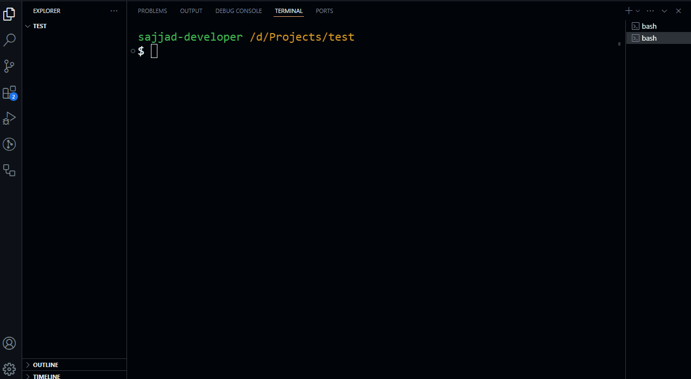
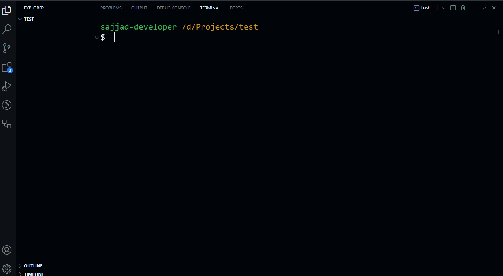
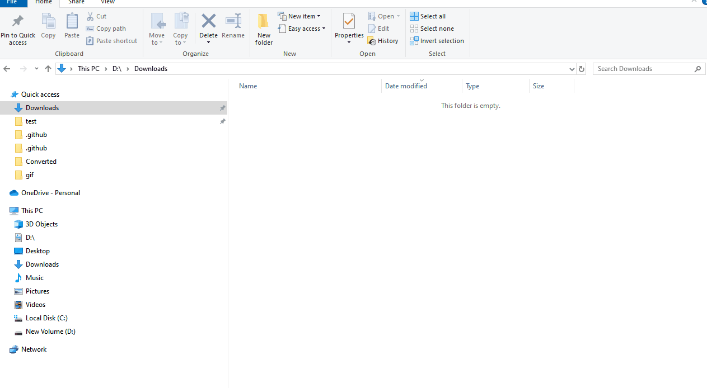

# `expenses-tracker-cli` 💰

<p align="center">
  
</p>

<h1 align="center">expenses-tracker-cli</h1>

<p align="center">
  <strong>💸 Take control of your finances from the command line with a powerful expense tracker featuring safe undo/redo, smart currency handling, typo correction, and beautiful PDF/CSV exports. 📈</strong>
</p>

<p align="center">
  <code>expenses-tracker-cli</code> — A beginner-friendly yet powerful CLI tool that simplifies personal expense tracking. Add transactions, view totals, manage currencies, export reports, and more — all from your terminal.
</p>

<p align="center">
<a href="https://www.npmjs.com/package/expenses-tracker-cli" target="_blank" rel="noopener noreferrer">
  
</a>
<a href="https://github.com/sajjad-developer/expenses-tracker-cli/actions/workflows/ci.yml" target="_blank" rel="noopener noreferrer">
  
</a>
<a href="https://github.com/sajjad-developer/expenses-tracker-cli/blob/main/LICENSE" target="_blank" rel="noopener noreferrer">
  
</a>
<a href="https://github.com/sajjad-developer/expenses-tracker-cli/issues?q=is%3Aissue+is%3Aopen+label%3A%22good+first+issue%22" target="_blank" rel="noopener noreferrer">
  
</a>
<a href="https://github.com/sajjad-developer/expenses-tracker-cli/issues?q=is%3Aissue+is%3Aopen+label%3Ahelp-wanted" target="_blank" rel="noopener noreferrer">
  
</a>
<a href="https://packagephobia.com/result?p=expenses-tracker-cli" target="_blank" rel="noopener noreferrer">
  
</a>
<a href="https://www.npmjs.com/package/expenses-tracker-cli" target="_blank" rel="noopener noreferrer">
  
<a href="https://github.com/sajjad-developer/expenses-tracker-cli/stargazers" target="_blank" rel="noopener noreferrer"></a>
</a>
</p>

---



## 📑 Table of Contents

- [✨ Features](#-features)
- [💡 Why `expenses-tracker-cli?` A Focus on Speed and Workflow](#-why-expenses-tracker-cli-a-focus-on-speed-and-workflow)
- [👤 Who Is This For?](#-who-is-this-for)
- [🚀 Live Demonstration](#-live-demonstration)
- [📦 Installation](#-installation)
  - [📝 Node.js and VS Code Setup (for non-programmers)](#step-1-install-nodejs)
  - [🌍 Global Installation](#option-1-global-installation)
  - [🚀 Run Directly Using npx](#option-2-run-directly-using-npx)
- [📋 Usage](#-usage)
- [💡 Usage Notes](#-usage-notes)
- [📝 Commands](#-commands)
- [🤔 Frequently Asked Questions (FAQ)](#-frequently-asked-questions-faq)
- [✅ Our Approach to Quality](#-our-approach-to-quality)
- [🤝 Contributing](#-contributing)
- [☕ Support My Work](#-support-my-work)
- [📄 License](#-license)

---

## ✨ Features

- Add new expenses with descriptions and currency.
- Intelligent currency handling with ISO 4217 suggestions.
- Filter expenses by date, day, month, week, or year.
- Undo/redo support for safe data manipulation.
- View totals grouped by currency.
- Export to clean PDF or CSV reports.
- Built-in manual generation via `manual` command.
- Clear CLI prompts, smart error messages, and typo suggestions.

---

## 💡 Why `expenses-tracker-cli?` A Focus on Speed and Workflow

In a world of heavy, slow-loading applications, simple tasks like tracking expenses can become a chore. Switching contexts to a mouse-driven GUI or a slow web app breaks your focus and kills productivity. Why open a bloated app just to log a single transaction?

`expenses-tracker-cli` was built as a direct solution, designed for a keyboard-first workflow that lets you manage finances with the speed and efficiency you expect from your favorite command-line tools.

With it, you get:

- `A True Command-Line Experience`: Stay in your terminal and log expenses in seconds without ever breaking your focus.

- `Blazing Speed`: Enjoy a zero-latency experience with minimal CPU and memory usage.

- `Total Data Ownership`: Your financial data is stored locally and securely on your machine, always under your control.

This tool offers a stress-free, efficient way to manage your finances, designed for those who are most productive in the terminal.

---

## 👤 Who Is This For?

`expenses-tracker-cli` is for anyone who values speed, simplicity, and control over their data. This tool is perfect for you if:

- `You're a Minimalist`: You prefer a clean, fast, and focused tool without the clutter of a graphical interface.

- `You're Privacy-Conscious`: You want to manage your financial data on your own machine, not on a third-party cloud.

- `You're an Efficient Organizer`: You want to log expenses in seconds and get back to your work without breaking your focus.

  > This tool is designed for anyone—from students, teachers, professionals, homemakers, and freelancers to developers and business owners—who values a **simple**, **private**, and **efficient** way to manage their personal finances.

---

## 🚀 Live Demonstration

A picture is worth a thousand words, and a GIF is worth a million. See for yourself how `expenses-tracker-cli` makes financial tracking simple and powerful.

---

<details>
<summary>🔰 <strong>Getting Started</strong></summary>

#### ➕ Add Expense



#### 💰 Currency-specific Expense Add


#### 🏷️ Set Expense Alias



#### 💱 Change Preferred Currency


#### 🌐 Currency Code Detection (Assistance)


</details>

---

<details>
<summary>📋 <strong>Managing Expenses</strong></summary>

#### 📋 List Expenses


#### 🔍 Filter Expense List


#### 📊 Total Summary


</details>

---

<details>
<summary>🧾 <strong>Edit & Adjust</strong></summary>

#### ✏️ Edit Expense


#### 🔄 Convert to Preferred Currency


</details>

---

<details>
<summary>❌ <strong>Manage Mistakes</strong></summary>

#### ❌ Delete Expense



#### ♻️ Recover Deleted Expense



#### ↩️ Undo & Redo


</details>

---

<details>
<summary>📤 <strong>Export & Manual</strong></summary>

#### 🧾 Export to PDF



#### 📂 Open Exported PDF


#### 💼 Export to CSV


#### 📂 Open Exported CSV


#### 📖 Manual Command


#### 📚 Open PDF Manual


</details>

---

## 📦 Installation

**Note**: If you're already familiar with **VS Code** and **Node.js**, you can skip the following installation steps and jump straight to the [Global Installation](#option-1-global-installation) or [Run Directly Using npx](#option-2-run-directly-using-npx) section.

Before using the **expenses-tracker-cli** tool, you'll need to have **Node.js** and **VS Code** installed on your computer. Follow the instructions below to set everything up.

> Prerequisite: This tool requires **Node.js version 18 or higher** to run correctly. You can check your version by typing `node -v` in your terminal.

### Step 1: Install Node.js

1. Visit the [Node.js download page](https://nodejs.org/).
2. Download the version labeled **LTS** (Long-Term Support).
3. Run the installer and follow the prompts to complete the installation.

You can verify that Node.js is installed by opening your terminal and typing the following command:

```bash
node -v
```

If you see the version number, Node.js is installed correctly.

### Step 2: Install VS Code (Visual Studio Code)

1. Visit the [VS Code download page](https://code.visualstudio.com/).
2. Download and install the appropriate version for your operating system.
3. Once installed, open any existing or newly created folder with the VS Code editor.
   - To open the integrated terminal:
     - Press <kbd>Ctrl</kbd> + <kbd>`</kbd> on **Windows**
     - Press <kbd>Cmd</kbd> + <kbd>`</kbd> on **Mac**

   - Alternatively, to toggle the entire panel that contains the terminal:
     - Press <kbd>Ctrl</kbd> + <kbd>J</kbd> on **Windows**
     - Press <kbd>Cmd</kbd> + <kbd>J</kbd> on **Mac**

### Option 1: Global Installation

```bash
npm install -g expenses-tracker-cli
```

### Option 2: Run Directly Using `npx`

```bash
npx expenses-tracker-cli <command>
```

---

## 📋 Usage

To view usage instructions:

```bash
expense
```

```
Welcome to expenses-tracker-cli! Your personal expense tracker.
--------------------------------------------------

To get started, try one of these commands:
expense add <amount> <description> - Add a new expense
expense list - View all your expenses
expense total - See your total spending
expense change-currency --currency <3-letter currency code e.g., USD, EUR> - Set
your preferred currency

You can also filter expenses based on week, month, year, or specific date when typing list,total or export subcommand.

For a full list of commands and options, type: expense --help
For a comprehensive PDF manual, type: expense manual [--open]
To undo your last action, type: expense undo
To redo your last undone action, type: expense redo
```

---

## 💡 Usage Notes

A few tips to ensure you get the most out of the tool:

---

### ✅ Use Options for Filtering

The `list`, `total`, and `export` commands **require** option flags (like `--date` or `--month`) for filtering. Do **not** pass dates or months directly as arguments.

```bash
# ✅ Correct:
expense list --month 8
expense total --date 2025-08-15

# ❌ Incorrect: This will trigger an error
expense list 2025-08-15
```

---

### ✅ Use Double Dashes (--) for Full Option Names

Always use a double dash (`--`) for full option names like `--currency`, `--month`. Use a single dash (`-`) only for one-letter aliases like `-c` for `--currency`.

Note: The filter flags (`--date`, `--month`, `--year`, etc.) do not have single-letter aliases and must be written in full.

```bash
# ✅ Correct:
expense list --month 8
expense add 50 "Tea" -c BDT

❌ Incorrect: These will cause an "unknown option" error
expense list -month 8
expense list -m 8
```

---

### ✅ Quote Your Descriptions

Descriptions with spaces must be wrapped in double quotes.

```bash
# ✅ Correct:
expense add 150 "Weekly grocery shopping"

# ❌ Incorrect: Only "Weekly" will be saved
expense add 150 Weekly grocery shopping
```

---

### ✅ Date and Currency Formats

- **Dates**: Use the `YYYY-MM-DD` format when filtering by date.

  ```bash
  expense total --date 2025-08-15
  ```

- **Currencies**: Use standard 3-letter [ISO 4217](https://www.thomsonreuters.com/en-us/help/legal-tracker/law-firm/international-currencies/list-of-currency-codes) currency codes like `USD`, `EUR`, `BDT`. The tool will guide you if you're unsure.

---

## 📝 Commands

Here is a detailed guide to all available commands. Click on any command to see its options and examples.

---

<details>
<summary><code>expense add</code> (or <code>a</code>) – Add a new expense</summary>

### `expense add`

Adds a new expense record to your data file.

**Usage:**

```bash
expense add [options] <amount> <description...>
```

**Arguments:**

| Argument           | Description                                                           |
| ------------------ | --------------------------------------------------------------------- |
| `<amount>`         | The numeric cost of the expense.                                      |
| `<description...>` | A description of the expense. Use quotes for multi-word descriptions. |

**Options:**

| Flag                    | Description                          | Default                 |
| ----------------------- | ------------------------------------ | ----------------------- |
| `-c, --currency <code>` | Specify a currency (e.g., USD, BDT). | Your preferred currency |

**Example:**

```bash
# Add an expense with a specific currency
expense add 45.50 "Lunch with the team" --currency BDT

# Same command using aliases
expense a 45.50 "Lunch with the team" -c BDT
```

</details>

<details>
<summary><code>expense list</code> (or <code>l</code>) – List and filter expenses</summary>

### `expense list`

Lists all recorded expenses with powerful filtering options.

**Usage:**

```bash
expense list [options]
```

**Options:**

| Flag        | Description                                     | Example                           |
| ----------- | ----------------------------------------------- | --------------------------------- |
| `--reindex` | Re-numbers displayed IDs starting from 1.       | `expense list --reindex`          |
| `--date`    | Filter by specific date (YYYY-MM-DD).           | `expense list --date 2025-08-15`  |
| `--day`     | Filter by day of the week (e.g., Monday).       | `expense list --day Sunday`       |
| `--month`   | Filter by month number.                         | `expense list --month 8`          |
| `--week`    | Filter by week of the month (requires --month). | `expense list --month 8 --week 2` |
| `--year`    | Filter by year.                                 | `expense list --year 2025`        |
| `--all`     | Include deleted expenses.                       | `expense list --all`              |

**Example:**

```bash
# List expenses for August 2025
expense list --month 8 --year 2025

# Same command using the alias
expense l --month 8 --year 2025
```

</details>

<details>
<summary><code>expense total</code> (or <code>t</code>) – Calculate and show totals</summary>

### `expense total`

Calculates total expenses, grouped by currency, with filtering options.

**Usage:**

```bash
expense total [options]
```

**Options:** (same as `expense list`)

| Flag      | Description                |
| --------- | -------------------------- |
| `--date`  | Filter by specific date.   |
| `--day`   | Filter by day of the week. |
| `--month` | Filter by month number.    |
| `--week`  | Filter by week of month.   |
| `--year`  | Filter by year.            |
| `--all`   | Include deleted expenses.  |

**Example:**

```bash
# Get the total for the year 2025
expense total --year 2025

# Same command using the alias
expense t --year 2025
```

</details>

<details>
<summary><code>expense edit</code> – Modify an existing expense</summary>

### `expense edit`

Modify details of an expense using its permanent ID.

**Usage:**

```bash
expense edit [options] <id>
```

**Arguments:**

| Argument | Description                  |
| -------- | ---------------------------- |
| `<id>`   | ID of the expense to modify. |

**Options:**

| Flag                       | Description                         |
| -------------------------- | ----------------------------------- |
| `-a, --amount <amount>`    | Change the expense amount.          |
| `-d, --description <text>` | Change the description. Use quotes. |
| `-c, --currency <code>`    | Change the currency.                |
| `--date <YYYY-MM-DD>`      | Change the date.                    |

**Example:**

```bash
expense edit 12 --amount 75.50 --description "Corrected price for lunch"
```

</details>

<details>
<summary><code>expense export</code> (or <code>x</code>) – Export data to PDF or CSV</summary>

### `expense export`

Export your expense data to a PDF or CSV file.

**Usage:**

```bash
expense export [options]
```

**Options:**

| Flag      | Description                                   |
| --------- | --------------------------------------------- |
| `--csv`   | Export to CSV.                                |
| `--pdf`   | Export to PDF.                                |
| `--open`  | Automatically open exported file.             |
| (filters) | All time filters from list command available. |
| `--all`   | Include deleted expenses.                     |

**Example:**

```bash
# Export a PDF for August 2025 and open it
expense export --pdf --month 8 --year 2025 --open

# Same command using the alias
expense x --pdf --month 8 --year 2025 --open
```

</details>

<details>
<summary><code>expense change-currency</code> – Set preferred currency</summary>

### `expense change-currency`

Sets your default currency and offers to convert past expenses.

**Usage:**

```bash
expense change-currency --currency <code>
```

**Options:**

| Flag                    | Description                 |
| ----------------------- | --------------------------- |
| `-c, --currency <code>` | Required. New currency code |

**Example:**

```bash
expense change-currency --currency BDT
```

</details>

<details>
<summary><code>expense delete</code> (or <code>d</code>) – Mark an expense as deleted</summary>

### `expense delete`

Soft-delete an expense (hidden unless `--all` is used).

**Example:**

```bash
expense delete 15

# Same command using the alias
expense d 15
```

</details>

<details>
<summary><code>expense recover</code> – Restore a deleted expense</summary>

### `expense recover`

Restore a previously deleted expense.

**Example:**

```bash
expense recover 15
```

</details>

<details>
<summary><code>expense reset</code> – Erase all expense data</summary>

### `expense reset`

Wipes all data (requires confirmation). Can be undone using `undo`.

**Example:**

```bash
expense reset
```

</details>

<details>
<summary><code>expense undo</code> & <code>redo</code> – Revert or re-apply actions</summary>

### `expense undo`

Reverts the last action:

```bash
expense undo
```

### `expense redo`

Re-applies the last undone action:

```bash
expense redo
```

</details>

<details>
<summary><code>expense manual</code> – Generate a PDF User Manual</summary>

### `expense manual`

Generates a full PDF guide and optionally opens it.

**Usage:**

```bash
expense manual [options]
```

**Options:**

| Flag     | Description                        |
| -------- | ---------------------------------- |
| `--open` | Automatically open the PDF manual. |

**Example:**

```bash
expense manual --open
```

</details>

---

## 🤔 Frequently Asked Questions (FAQ)

**Q: Where is my expense data stored?**

**A:** Your data is securely and permanently stored in a `.expense` directory inside your user’s home folder (`~/.expense/`). It is **not** stored in your current working directory, and your data will remain intact even if you restart your computer or update the tool.

**Q: I'm a developer. Is it safe to work on this project without committing my own expense data?**

**A:** Yes, absolutely. The project's `.gitignore` file is specifically configured to ignore the `.expense/` data directory. This ensures that your personal expense data is never tracked by Git or accidentally committed to the repository while you work on the code.

**Q: Where are the exported files (PDF/CSV) and the manual saved?**

**A:** All generated files, including PDF/CSV exports and the user manual, are automatically saved directly into your user's **Downloads** folder.

**Q: Can I run this from any folder?**

**A:** Yes. Whether you've installed the tool globally with `npm install -g` or run it using `npx`, the `expense` command will work from any directory in your terminal. It always accesses the same central data store.

**Q: Will I lose my data if I reinstall or update the tool?**

**A:** No. Your data is stored independently of the tool's code. This means you can safely update, reinstall, or switch between `npm` and `npx` without risking any data loss.

**Q: How does currency handling work? Can I use multiple currencies?**

**A:** Yes. The tool gives you two levels of control over your currencies for maximum flexibility:

> **1. Setting the Default Currency**
>
> You can set your preferred currency at any time. This will be used by default for all future expenses.
>
> ```bash
> # Set your default currency to Euros
> expense change-currency --currency EUR
> ```
>
> Now, any new expense added without a currency flag will be in EUR.
>
> ```bash
> # This expense will be recorded as 15 EUR
> expense add 15 "Lunch"
> ```
>
> **2. Overriding the Default for a Single Expense**
>
> For one-off transactions in a different currency, simply use the `--currency` flag when adding an expense.
>
> ```bash
> # Add a specific expense in US Dollars, even if your default is EUR
> expense add 20 "Souvenir" --currency USD
> ```
>
> **3. Interactive Assistance for Finding and Converting Currencies**
>
> The CLI is designed to help you when you're unsure about currency codes or exchange rates:
>
> - **Finding Currency Codes:** If you enter an incorrect currency code, the tool will suggest a correction. It will also offer to open a web browser with a list of official ISO 4217 currency codes for you to reference.
> - **Easy Conversions:** When you use `expense change-currency` or `expense total`, the tool may ask if you want to convert amounts. If you agree, it provides links to reliable exchange rate websites (XE.com, Wise, and OANDA) and prompts you to enter the rate.
> - **Safe by Default:** All confirmation prompts are designed to be safe. You must type `y` and press **Enter** to confirm an action. If you type `N` and press **Enter**, no changes will be made. If you just press **Enter** or type anything else and press **Enter**, the tool will default to "No," ensuring no changes are made accidentally.

> In short: `expense change-currency` sets your **persistent preference**, and `expense add --currency` provides **transaction-specific flexibility**, and the tool **actively guides you** through the process.

**Q: What if I don't know the correct 3-letter currency code?**

**A:** The tool is designed to help you. If you enter an unknown currency code, it will try to suggest a correction. It can also provide direct links to reliable sources like Thomson Reuters and IBAN.com to help you look up the correct ISO 4217 code. You will then be prompted to type 1 or 2 to open your chosen link in a web browser.

**Q: What happens if I keep entering invalid information at a prompt?**

**A:** To ensure a smooth experience, most interactive prompts (like when providing a currency code or an exchange rate) will give you three attempts to enter valid information. The tool will display the current attempt count in the prompt (e.g., `Attempt 1/3`). If you do not provide a valid entry after three tries, the operation will be safely cancelled to prevent errors.

---

## ✅ Our Approach to Quality

This CLI tool has been rigorously tested to ensure all features work as expected. Due to the highly interactive nature of many commands (e.g., multi-step prompts for currency conversion), we have focused on end-to-end manual testing, which best simulates the real-world user experience.

Every command has been manually verified, including:

- Adding, editing, deleting, and recovering expenses.
- Listing and totaling with all filter combinations.
- The full interactive currency conversion flow.
- Successful generation and content of PDF and CSV exports.
- The undo/redo/reset functionality.

---

## 🤝 Contributing

We welcome all contributions!  
If you'd like to fix a bug, suggest a new feature, or help with documentation:

1. Read [CONTRIBUTING.md](./CONTRIBUTING.md)
2. Fork the repo and make your changes
3. Submit a pull request

> 💡 Check issues labeled `good first issue` or `help wanted`.

---

## ☕ Support My Work

✨ This project is developed and maintained by me during my personal time.  
If **expenses-tracker-cli** has saved you time or improved your workflow, please consider leaving a **voluntary tip** to support ongoing development:

[](https://eco-starfish-coder.com/tip)

> ⚠️ Tips are optional and go directly to the maintainer. This project is free and open-source.

---

## 📄 License

Licensed under the **MIT License**. See the [LICENSE](LICENSE) file for more info.
