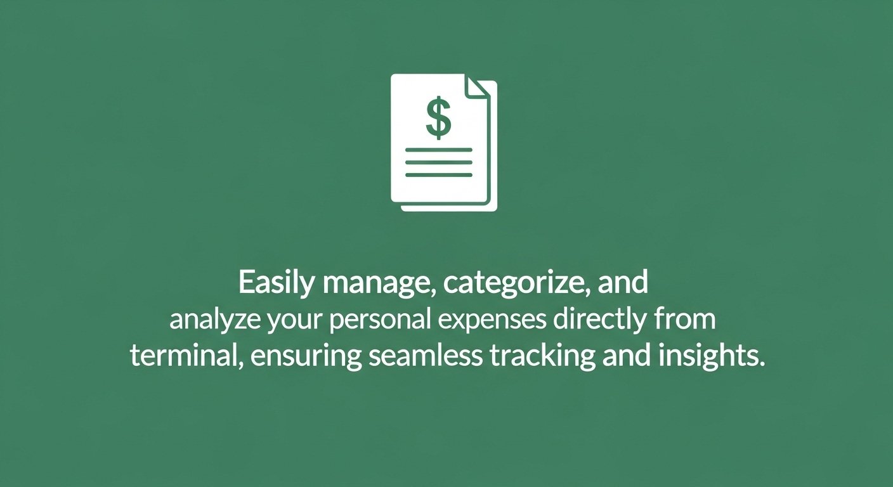

# `expenses-tracker-cli` 💰

<p align="center">
  
</p>

<h1 align="center">expenses-tracker-cli</h1>

<p align="center">
  <strong>💸 Take control of your finances! Effortlessly track, categorize, and analyze your personal expenses right from your terminal. 📈</strong>
</p>

<p align="center">
  <code>expenses-tracker-cli</code> — A beginner-friendly yet powerful CLI tool that simplifies personal expense tracking. Add transactions, view totals, manage currencies, export reports, and more — all from your terminal.
</p>

<p align="center">
<a href="https://www.npmjs.com/package/expenses-tracker-cli" target="_blank" rel="noopener noreferrer">
  
</a>
<a href="https://github.com/sajjad-developer/expenses-tracker-cli/actions/workflows/ci.yml" target="_blank" rel="noopener noreferrer">
  
</a>
<a href="https://github.com/sajjad-developer/expenses-tracker-cli/blob/main/LICENSE" target="_blank" rel="noopener noreferrer">
  
</a>
<a href="https://github.com/sajjad-developer/expenses-tracker-cli/issues?q=is%3Aissue+is%3Aopen+label%3A%22good+first+issue%22" target="_blank" rel="noopener noreferrer">
  
</a>
<a href="https://github.com/sajjad-developer/expenses-tracker-cli/issues?q=is%3Aissue+is%3Aopen+label%3Ahelp-wanted" target="_blank" rel="noopener noreferrer">
  
</a>
<a href="https://packagephobia.com/result?p=expenses-tracker-cli" target="_blank" rel="noopener noreferrer">
  
</a>
<a href="https://www.npmjs.com/package/expenses-tracker-cli" target="_blank" rel="noopener noreferrer">
  
<a href="https://github.com/sajjad-developer/expenses-tracker-cli/stargazers" target="_blank" rel="noopener noreferrer"></a>
</a>
</p>

---

## 📑 Table of Contents

- [✨ Features](#-features)
- [🚀 Live Demonstration](#-live-demonstration)
- [📦 Installation](#-installation)
  - [📝 Node.js and VS Code Setup (for non-programmers)](#step-1-install-nodejs)
  - [🌍 Global Installation](#option-1-global-installation)
  - [🚀 Run Directly Using npx](#option-2-run-directly-using-npx)
- [📋 Usage](#-usage)
- [💡 Usage Notes](#-usage-notes)
- [📝 Commands](#-commands)
- [🤔 Frequently Asked Questions (FAQ)](#-frequently-asked-questions-faq)
- [✅ Our Approach to Quality](#-our-approach-to-quality)
- [🤝 Contributing](#-contributing)
- [☕ Support My Work](#-support-my-work)
- [📄 License](#-license)

---

## ✨ Features

- Add new expenses with descriptions and currency.
- Intelligent currency handling with ISO 4217 suggestions.
- Filter expenses by date, day, month, week, or year.
- Undo/redo support for safe data manipulation.
- View totals grouped by currency.
- Export to clean PDF or CSV reports.
- Built-in manual generation via `manual` command.
- Clear CLI prompts, smart error messages, and typo suggestions.

---

## 🚀 Live Demonstration

A picture is worth a thousand words, and a GIF is worth a million. See for yourself how expenses-tracker-cli makes financial tracking simple and powerful.

### 💱 Interactive Currency Conversion

_(Your GIF showing the `expense change-currency --currency EUR` flow would go here)_

### 📄 PDF Export and Auto-Open

_(Your GIF showing the `expense export --pdf --open` flow would go here)_

### 🔎 Advanced Filtering

_(Your GIF showing a `list` or `total` command with filters would go here)_

---

## 📦 Installation

**Note**: If you're already familiar with **VS Code** and **Node.js**, you can skip the following installation steps and jump straight to the [Global Installation](#option-1-global-installation) or [Run Directly Using npx](#option-2-run-directly-using-npx) section.

Before using the **Bachelor Meal CLI Tool**, you'll need to have **Node.js** and **VS Code** installed on your computer. Follow the instructions below to set everything up.

### Step 1: Install Node.js

1. Visit the [Node.js download page](https://nodejs.org/).
2. Download the version labeled **LTS** (Long-Term Support).
3. Run the installer and follow the prompts to complete the installation.

You can verify that Node.js is installed by opening your terminal and typing the following command:

```bash
node -v
```

If you see the version number, Node.js is installed correctly.

### Step 2: Install VS Code (Visual Studio Code)

1. Visit the [VS Code download page](https://code.visualstudio.com/).
2. Download and install the appropriate version for your operating system.
3. Once installed, open any existing or newly created folder with the VS Code editor. To open the integrated terminal, press Ctrl + `on Windows (or Cmd +` on Mac), or use Ctrl + J on Windows (or Cmd + J on Mac) to toggle the panel that contains the terminal.

### Option 1: Global Installation

```bash
npm install -g expenses-tracker-cli
```

### Option 2: Run Directly Using `npx`

```bash
npx expenses-tracker-cli <command>
```

---

## 📋 Usage

To view usage instructions:

```bash
expense
```

```
Welcome to expenses-tracker-cli! Your personal expense tracker.
--------------------------------------------------

To get started, try one of these commands:
expense add <amount> <description> - Add a new expense
expense list - View all your expenses
expense total - See your total spending
expense change-currency --currency <3-letter currency code e.g., USD, EUR> - Set
your preferred currency

You can also filter expenses based on week, month, year, or specific date when typing list,total or export subcommand.

For a full list of commands and options, type: expense --help
For a comprehensive PDF manual, type: expense manual [--open]
To undo your last action, type: expense undo
To redo your last undone action, type: expense redo
```

---

## 💡 Usage Notes

A few tips to ensure you get the most out of the tool:

---

### ✅ Use Options for Filtering

The `list`, `total`, and `export` commands **require** option flags (like `--date` or `--month`) for filtering. Do **not** pass dates or months directly as arguments.

```bash
# ✅ Correct:
expense list --month 8
expense total --date 2025-08-15

# ❌ Incorrect: This will trigger an error
expense list 2025-08-15
```

---

### ✅ Use Double Dashes (--) for Full Option Names

Always use a double dash (`--`) for full option names like `--currency`, `--month`. Use a single dash (`-`) only for one-letter aliases like `-c`.

```bash
# ✅ Correct:
expense list --month 8
expense add 50 "Tea" -c BDT

# ❌ Incorrect: This will be misinterpreted
expense list -month 8
```

---

### ✅ Quote Your Descriptions

Descriptions with spaces must be wrapped in double quotes.

```bash
# ✅ Correct:
expense add 150 "Weekly grocery shopping"

# ❌ Incorrect: Only "Weekly" will be saved
expense add 150 Weekly grocery shopping
```

---

### ✅ Date and Currency Formats

- **Dates**: Use the `YYYY-MM-DD` format when filtering by date.

  ```bash
  expense total --date 2025-08-15
  ```

- **Currencies**: Use standard 3-letter [ISO 4217](https://www.thomsonreuters.com/en-us/help/legal-tracker/law-firm/international-currencies/list-of-currency-codes) currency codes like `USD`, `EUR`, `BDT`. The tool will guide you if you're unsure.

---

## 📝 Commands

Here is a detailed guide to all available commands. Click on any command to see its options and examples.

---

<details>
<summary><code>expense add</code> (or <code>a</code>) – Add a new expense</summary>

### `expense add`

Adds a new expense record to your data file.

**Usage:**

```bash
expense add [options] <amount> <description...>
```

**Arguments:**

| Argument           | Description                                                           |
| ------------------ | --------------------------------------------------------------------- |
| `<amount>`         | The numeric cost of the expense.                                      |
| `<description...>` | A description of the expense. Use quotes for multi-word descriptions. |

**Options:**

| Flag                    | Description                          | Default                 |
| ----------------------- | ------------------------------------ | ----------------------- |
| `-c, --currency <code>` | Specify a currency (e.g., USD, BDT). | Your preferred currency |

**Example:**

```bash
expense add 45.50 "Lunch with the team" --currency BDT
```

</details>

<details>
<summary><code>expense list</code> (or <code>l</code>) – List and filter expenses</summary>

### `expense list`

Lists all recorded expenses with powerful filtering options.

**Usage:**

```bash
expense list [options]
```

**Options:**

| Flag        | Description                                     | Example                           |
| ----------- | ----------------------------------------------- | --------------------------------- |
| `--reindex` | Re-numbers displayed IDs starting from 1.       | `expense list --reindex`          |
| `--date`    | Filter by specific date (YYYY-MM-DD).           | `expense list --date 2025-08-15`  |
| `--day`     | Filter by day of the week (e.g., Monday).       | `expense list --day Sunday`       |
| `--month`   | Filter by month number.                         | `expense list --month 8`          |
| `--week`    | Filter by week of the month (requires --month). | `expense list --month 8 --week 2` |
| `--year`    | Filter by year.                                 | `expense list --year 2025`        |
| `--all`     | Include deleted expenses.                       | `expense list --all`              |

**Example:**

```bash
expense list --month 8 --year 2025
```

</details>

<details>
<summary><code>expense total</code> (or <code>t</code>) – Calculate and show totals</summary>

### `expense total`

Calculates total expenses, grouped by currency, with filtering options.

**Usage:**

```bash
expense total [options]
```

**Options:**

Same time-based filters as `expense list`.

| Flag      | Description                |
| --------- | -------------------------- |
| `--date`  | Filter by specific date.   |
| `--day`   | Filter by day of the week. |
| `--month` | Filter by month number.    |
| `--week`  | Filter by week of month.   |
| `--year`  | Filter by year.            |
| `--all`   | Include deleted expenses.  |

**Example:**

```bash
expense total --year 2025
```

</details>

<details>
<summary><code>expense edit</code> – Modify an existing expense</summary>

### `expense edit`

Modify details of an expense using its permanent ID.

**Usage:**

```bash
expense edit [options] <id>
```

**Arguments:**

| Argument | Description                  |
| -------- | ---------------------------- |
| `<id>`   | ID of the expense to modify. |

**Options:**

| Flag                       | Description                         |
| -------------------------- | ----------------------------------- |
| `-a, --amount <amount>`    | Change the expense amount.          |
| `-d, --description <text>` | Change the description. Use quotes. |
| `-c, --currency <code>`    | Change the currency.                |
| `--date <YYYY-MM-DD>`      | Change the date.                    |

**Example:**

```bash
expense edit 12 --amount 75.50 --description "Corrected price for lunch"
```

</details>

<details>
<summary><code>expense export</code> (or <code>x</code>) – Export data to PDF or CSV</summary>

### `expense export`

Export your expense data to a file.

**Usage:**

```bash
expense export [options]
```

**Options:**

| Flag      | Description                                     |
| --------- | ----------------------------------------------- |
| `--csv`   | Export to CSV.                                  |
| `--pdf`   | Export to PDF.                                  |
| `--open`  | Automatically open exported file.               |
| (filters) | All time filters from `list` command available. |
| `--all`   | Include deleted expenses.                       |

**Example:**

```bash
expense export --pdf --month 8 --year 2025 --open
```

</details>

<details>
<summary><code>expense change-currency</code> – Set preferred currency</summary>

### `expense change-currency`

Sets your default currency and offers to convert past expenses.

**Usage:**

```bash
expense change-currency --currency <code>
```

**Options:**

| Flag                    | Description                      |
| ----------------------- | -------------------------------- |
| `-c, --currency <code>` | Required. New 3-letter currency. |

**Example:**

```bash
expense change-currency --currency BDT
```

</details>

<details>
<summary><code>expense delete</code>, <code>recover</code>, <code>reset</code> – Data Management</summary>

### Data Management Commands

#### `expense delete <id>`

Soft-delete an expense (hidden unless `--all` used).

```bash
expense delete 15
```

#### `expense recover <id>`

Restore a previously deleted expense.

```bash
expense recover 15
```

#### `expense reset`

Wipes all data (requires confirmation). Can be undone using `undo`.

```bash
expense reset
```

</details>

<details>
<summary><code>expense undo</code> & <code>redo</code> – Revert or re-apply actions</summary>

### `expense undo`

Reverts the last action:

```bash
expense undo
```

### `expense redo`

Re-applies the last undone action:

```bash
expense redo
```

</details>

<details>
<summary><code>expense manual</code> – Generate a PDF User Manual</summary>

### `expense manual`

Generates a full PDF guide of all commands.

**Usage:**

```bash
expense manual [options]
```

**Options:**

| Flag     | Description                        |
| -------- | ---------------------------------- |
| `--open` | Automatically open the PDF manual. |

**Example:**

```bash
expense manual --open
```

</details>

---

## 🤔 Frequently Asked Questions (FAQ)

**Q: Where is my expense data stored?**

**A:** Your data is securely and permanently stored in a `.expense` directory inside your user’s home folder (`~/.expense/`). It is **not** stored in your current working directory, and your data will remain intact even if you restart your computer or update the tool.

**Q: Can I run this from any folder?**

**A:** Yes. Whether you've installed the tool globally with `npm install -g` or run it using `npx`, the `expense` command will work from any directory in your terminal. It always accesses the same central data store.

**Q: Will I lose my data if I reinstall or update the tool?**

**A:** No. Your data is stored independently of the tool's code. This means you can safely update, reinstall, or switch between `npm` and `npx` without risking any data loss.

**Q: How does currency handling work? Can I use multiple currencies?**

**A:** Yes. The tool gives you two levels of control over your currencies for maximum flexibility:

> **1. Setting the Default Currency**
>
> You can set your preferred currency at any time. This will be used by default for all future expenses.
>
> ```bash
> # Set your default currency to Euros
> expense change-currency --currency EUR
> ```
>
> Now, any new expense added without a currency flag will be in EUR.
>
> ```bash
> # This expense will be recorded as 15 EUR
> expense add 15 "Lunch"
> ```
>
> **2. Overriding the Default for a Single Expense**
>
> For one-off transactions in a different currency, simply use the `--currency` flag when adding an expense.
>
> ```bash
> # Add a specific expense in US Dollars, even if your default is EUR
> expense add 20 "Souvenir" --currency USD
> ```
>
> In short: `expense change-currency` sets your **persistent preference**, and `expense add --currency` provides **transaction-specific flexibility**.

---

## ✅ Our Approach to Quality

This CLI tool has been rigorously tested to ensure all features work as expected. Due to the highly interactive nature of many commands (e.g., multi-step prompts for currency conversion), we have focused on end-to-end manual testing, which best simulates the real-world user experience.

Every command has been manually verified, including:

- Adding, editing, deleting, and recovering expenses.
- Listing and totaling with all filter combinations.
- The full interactive currency conversion flow.
- Successful generation and content of PDF and CSV exports.
- The undo/redo/reset functionality.

---

## 🤝 Contributing

We welcome all contributions!  
If you'd like to fix a bug, suggest a new feature, or help with documentation:

1. Read [CONTRIBUTING.md](./CONTRIBUTING.md)
2. Fork the repo and make your changes
3. Submit a pull request

> 💡 Check issues labeled `good first issue` or `help wanted`.

---

## ☕ Support My Work

✨ This project is developed and maintained by me during my personal time.  
If **expenses-tracker-cli** has saved you time or improved your workflow, please consider leaving a **voluntary tip** to support ongoing development:

[](https://eco-starfish-coder.com/tip)

> ⚠️ Tips are optional and go directly to the maintainer. This project is free and open-source.

---

## 📄 License

Licensed under the **MIT License**. See the [LICENSE](LICENSE) file for more info.
